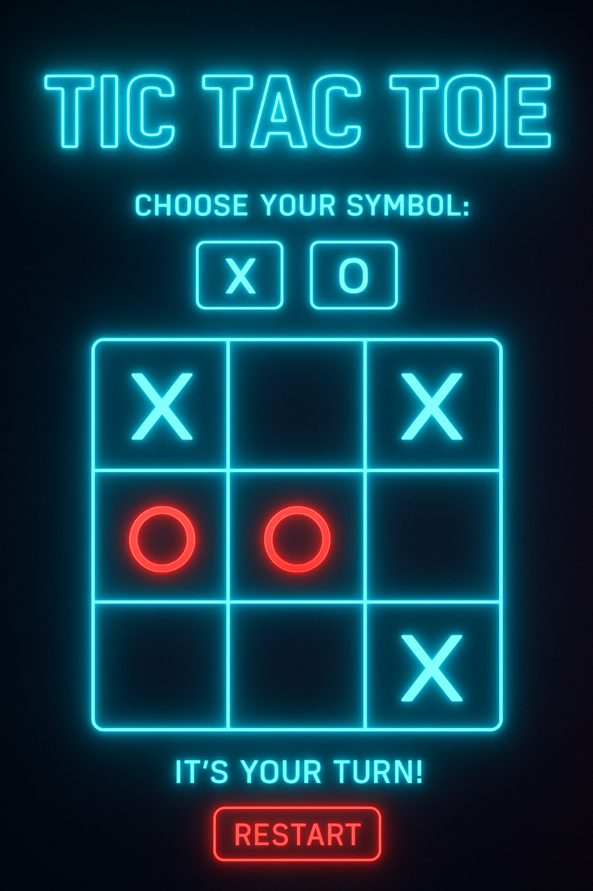
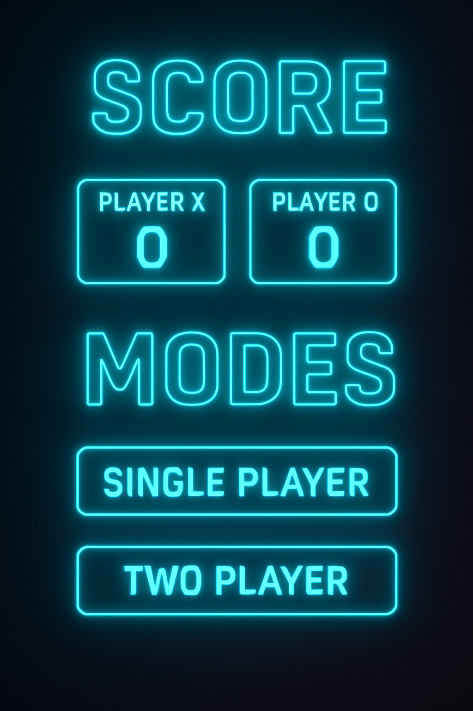

# Tic Tac Toe — Juego (vs. CPU y 2 jugadores)

Juego de **Tic Tac Toe** inspirado en el desafío de freeCodeCamp.
Permite jugar contra la computadora (IA Minimax invencible) o entre dos jugadores, seleccionar X/O y llevar marcador de victorias/empates. Además resalta la línea ganadora.

Demo de referencia (freeCodeCamp): [https://codepen.io/freeCodeCamp/full/KzXQgy/](https://codepen.io/freeCodeCamp/full/KzXQgy/)

---

## 📝 Resumen / Objetivo

Este repositorio contiene una implementación del reto de freeCodeCamp:

> **User Stories**

* Puedo jugar una partida de Tic Tac Toe contra la computadora.
* El juego se reinicia tan pronto como termina para poder jugar otra vez.
* Puedo elegir si jugar con X u O.

He añadido funciones extras (marcador persistente durante la sesión, modo PvP y resalte de la línea ganadora) manteniendo la mecánica pedida.

---

## 📂 Estructura del proyecto

```
/
├─ index.html
├─ styles.css
├─ script.js
├─ README.md    ← (este archivo)
└─ assets/      ← (opcional: imágenes, iconos, etc.)
```

---

## 🚀 Cómo usar / Ejecutar localmente

1. Clona el repositorio:

   ```bash
   git clone https://github.com/TU_USUARIO/tic-tac-toe.git
   cd tic-tac-toe
   ```

2. Abrir `index.html` en tu navegador (doble clic o `Open with → Browser`).

> Alternativa: publica el repositorio en **GitHub Pages** (Settings → Pages) para obtener un enlace público.

---

## 🧩 Contenido y características

* **Modo PvC (Jugador vs Computadora)** con algoritmo Minimax (jugador difícil — invencible).
* **Modo PvP (Jugador vs Jugador)** para dos humanos en el mismo dispositivo.
* **Selector de símbolo**: el jugador puede elegir ser `X` o `O`.
* **Reinicio**: botón de reinicio; al terminar la partida se muestra el resultado y puedes reiniciar.
* **Marcador** que acumula victorias de X, victorias de O y empates durante la sesión.
* **Resalte de línea ganadora**: cuando hay victoria, las tres celdas se iluminan.
* **Estilo visual único**: tema neón/ciberpunk con animaciones (en `styles.css`).

---

## ✅ Cómo se cumplen las User Stories (freeCodeCamp)

* **Puedo jugar una partida contra la computadora.**
  -> Modo PvC activo por defecto, la IA usa Minimax y responde automáticamente.

* **Mi juego se reiniciará tan pronto como termine para poder jugar de nuevo.**
  -> Después del resultado se muestra el estado y el usuario puede reiniciar con el botón; si prefieres reinicio automático, hay una variable en `script.js` que se puede activar.

* **Puedo elegir si quiero jugar como X u O.**
  -> Botones `X` / `O` en la interfaz permiten seleccionar el símbolo antes de comenzar.

---

## 🛠 Tecnologías

* HTML5
* CSS3
* JavaScript (Vanilla)
* (Opcional) Git & GitHub Pages para despliegue

---

## 📸 Capturas




---

## 📎 Enlace del proyecto en CodePen / freeCodeCamp

**CodePen:** `https://codepen.io/Soufiane-Raki/pen/jEbJqwX`

---

## 🧪 Tests / verificación (freeCodeCamp)

freeCodeCamp verifica principalmente la funcionalidad del juego (elegir X/O, jugar contra la computadora, reinicio). Para pasar los tests:

* Asegúrate de que la IA responda y no dependa de clicks ocultos.
* Que el selector X/O altere correctamente los turnos.
* Que el juego detecte victorias y empates y permita jugar otra vez.
* Si usas el tester de freeCodeCamp, pega el HTML/CSS/JS en el CodePen provisto por el reto.

---

## ♻️ Posibles mejoras (ideas)

* Añadir **niveles** de dificultad (fácil/medio/imposible).
* Guardar marcadores en `localStorage` para persistir entre sesiones.
* Animación de línea ganadora como barra que atraviesa el tablero.
* Sonidos y accesibilidad (lectura por voz, foco en teclado).

---

## ✨ Créditos

* Inspiración: freeCodeCamp Tic Tac Toe project (CodePen).
  [https://codepen.io/freeCodeCamp/full/KzXQgy/](https://codepen.io/freeCodeCamp/full/KzXQgy/)

---

## 📄 Licencia

Este proyecto está bajo la licencia **MIT** — siéntete libre de usarlo y modificarlo. Añade un `LICENSE` si lo deseas.

---

## ✅ Checklist antes de entregar a freeCodeCamp

* [ ] Pegar el HTML/CSS/JS en un **CodePen** limpio (HTML panel, CSS panel, JS panel).
* [ ] Probar las User Stories en CodePen (selector X/O, jugar contra la IA, reinicio).
* [ ] Copiar la URL del CodePen y pulsar **"I've completed this challenge"** en freeCodeCamp.
* [ ] (Opcional) Añadir link al CodePen en el `README.md` del repositorio.
